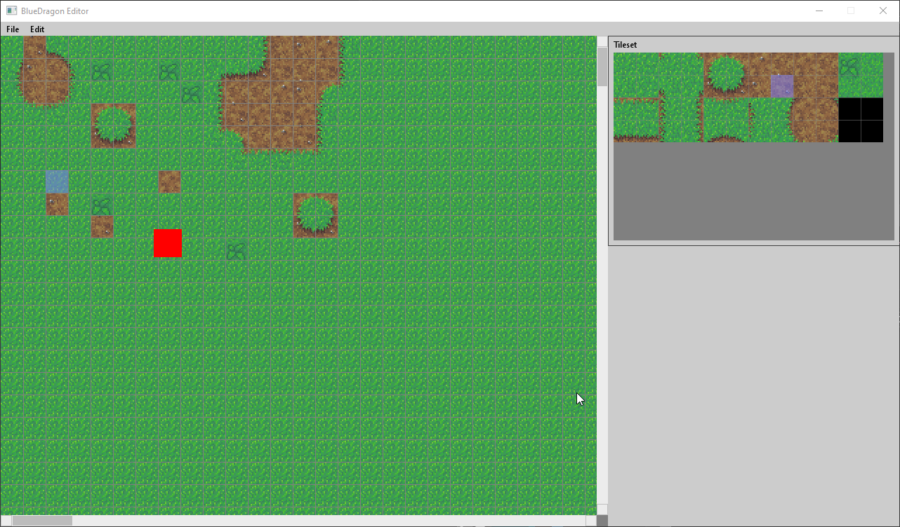

# BlueDragon

A 2d tilemap (scrollable) editor for my Coral project. This editor was made entirely with C and used the SDL2 library. It has a simple menu and a toolbox at the right for selecting which tile to draw with. Scrollbar almost finished and only lacks the drag feature. For game see: Coral

Tags: C, Editor, Tilemap, SDL2
